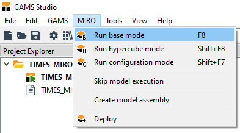
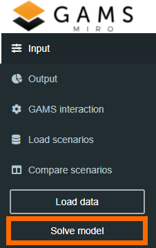
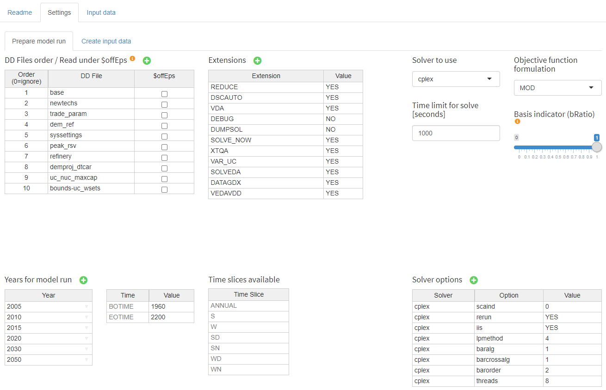
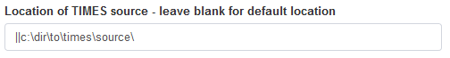
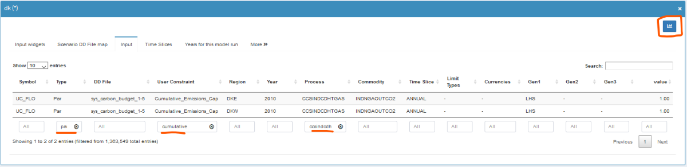
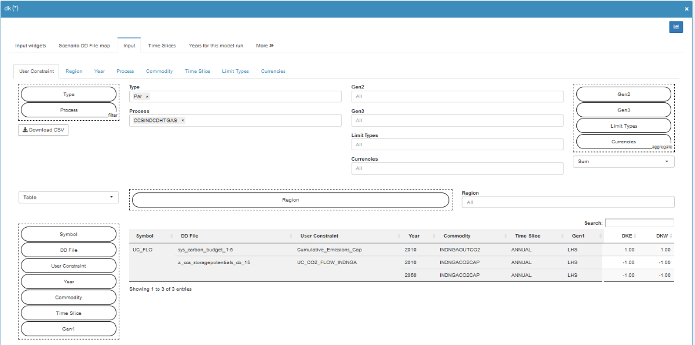
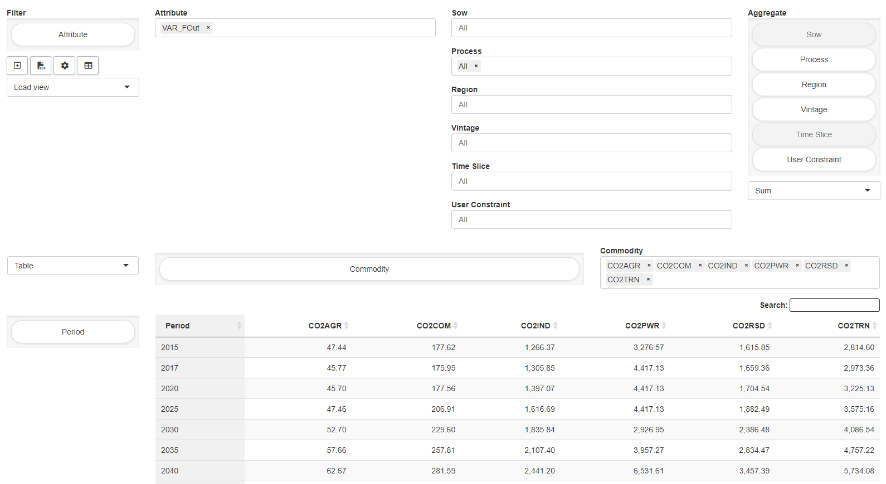
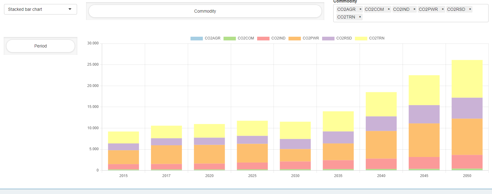
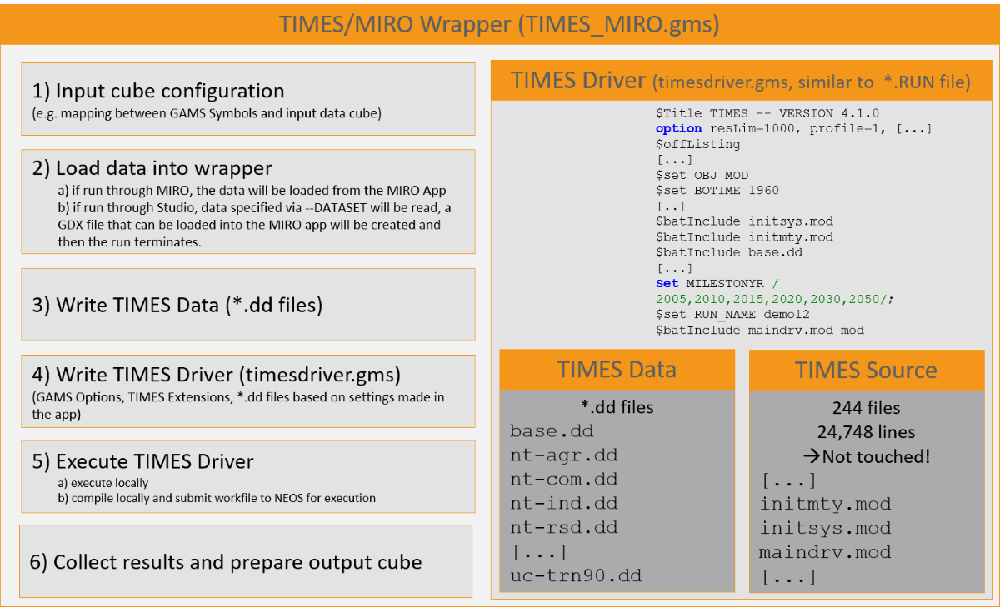

Table of Contents
=================

   * [TIMES MIRO App](#times_miro-app)
      * [Prerequisites](#prerequisites)
      * [Usage of the App](#usage-of-the-app)
         * [Launch the deployed TIMES MIRO app](#launch-the-deployed-times_miro-app)
         * [Launch TIMES MIRO from GAMS Studio](#launch-times_miro-from-gams-studio)
         * [App Structure](#app-structure)
            * [Input View](#input-view)
                * [Input Widgets](#input-widgets)
                * [Scenario DD File map](#scenario-dd-file-map)
                * [Input](#input)
                * [Timeslices](#timeslices)
                * [Years for this model run](#years-for-this-model-run)
                * [DD Files](#dd-files)
                * [TIMES Extensions](#times-extensions)
                * [Solver Options](#solver-options)
            * [Output View](#output-view)
            * [GAMS Interaction View](#gams-interaction-view)
            * [Compare Scenarios View](#compare-scenarios-view)
      * [Code Structure](#code-structure)
   * [License](#license)

# TIMES MIRO App<a name="times_miro-app"></a>
This is a [GAMS MIRO](https://gams.com/miro) app for the [IEA-ETSAP TIMES](https://github.com/etsap-TIMES/TIMES_model) model.

To obtain the app, including the [TIMES_Demo](https://github.com/etsap-TIMES/TIMES_Demo) data set and the the [TIMES-DK\_COMETS](https://github.com/energy-modelling-club/TIMES-DK_COMETS) data sets, run the following command:
> git clone --recurse-submodules https://github.com/GAMS-dev/TIMES_MIRO.git

The app allows the user to load different data sets, to set TIMES options, to manipulate input data and to analyze output data. Furthermore, the user can decide whether the model should be solved locally or submitted to the [NEOS optimization server](https://neos-server.org/neos/). 

The app itself works with a free GAMS demo license which can be requested through an online [form](https://www.gams.com/download/). The NEOS option provides a way to also solve models that go beyond the [GAMS demo limits](https://www.gams.com/latest/docs/UG_License.html#General_Information) with a free GAMS demo license.

## Prerequisites<a name="prerequisites"></a>
In order to use the TIMES MIRO app you need
* to clone this repository or download the self contained *.miroapp file (https://github.com/GAMS-dev/TIMES_MIRO/releases)
* to install GAMS 31.2.0 or newer (https://www.gams.com/download/)
* to install GAMS MIRO 1.1.0 or newer (https://www.gams.com/miro/download.html)

## Usage of the App<a name="usage-of-the-app"></a>
The app comes with two predefined data sets, the [TIMES_Demo](https://github.com/etsap-TIMES/TIMES_Demo) data set (default) and the the [TIMES-DK\_COMETS](https://github.com/energy-modelling-club/TIMES-DK_COMETS) data set. Other data sets can be created from \*.dd files (see [below](#how-to-prepare-your-own-times-data-set-for-usage-with-the-app)).

The TIMES MIRO demo app can be launched in different ways.

### Launch the deployed TIMES MIRO app<a name="launch-the-deployed-times_miro-app"></a>
Download the deployed TIMES MIRO app from https://github.com/GAMS-dev/TIMES_MIRO/releases, double click on `times_miro.miroapp`, add the app to your MIRO Library and launch it. 

### Launch TIMES MIRO from GAMS Studio<a name="launch-times_miro-from-gams-studio"></a>
Clone this Github repository as described [above](#times_miro-app). To launch the TIMES MIRO app, open `times_miro.gms` in [GAMS Studio](https://www.gams.com/latest/docs/T_STUDIO.html) and press F8 or select *MIRO --> Run base mode* from the ribbon menu.



### App Structure<a name="app-structure"></a>
After launching the app as described above, the app should open inside the browser
The app follows the common [MIRO App Structure](https://www.gams.com/miro/start.html#miro-structure) with a navigation bar on the left side to switch between the following views:
* Input View
* Output View
* GAMS Interaction View
* Compare Scenarios View 

Furthermore it allows to load data from different data sources (e.g. the MIRO Database or a GDX file).
Finally, the menu on the left also contains a solve button that allows to start a run based on settings and data specified in the input view.



#### Input View<a name="input-view"></a>
The input view is organized in multiple tabs which are described below.

##### Input Widgets<a name="input-widgets"></a>
The Input widgets tab allows to specify some basic settings. Most of them should be self explaining but the 4 highlighted in the following screenshot are explained in detail below.



`Location of DD files` and `Location of RUN file`:

These two widgets can be used to prepare a new TIMES data set for import into the app from existing \*.dd files and a \*.RUN file.
`Location of DD files` is used to point to a directory containing a set of \*.dd files.
`Location of RUN file` is used to point to a \*.RUN file (file extension can be different).
These two widgets only have an impact if there is currently no other TIMES MIRO scenario is active, i.e. that for example the input tab shows no data. To close a currently active MIRO scenario, click the cross in the upper right corner (purple circle in the screenshot above).
If the user hits "Solve Model" an input cube will be created from the \*.dd files taht can be found in the corresponding directory and a TIMES scenario will be defined by automatically extracting TIMES extensions, active \*.dd files, etc. from the \*.RUN file. Note that this approach is convenient but also fragile because if the RUN file contains unexpected content, things might fail


`Location of TIMES source - leave blank for default location`:

For this widget, it should be noted that the default location refers to the the 'source' subdirectory that comes with the [TIMES_Demo repository](https://github.com/etsap-TIMES/TIMES_Demo) which is embedded as a git submodule. If another TIMES source should be used, the path to the corresponding folder can be entered to this field. Due to the implementation of this option via a [singleton set](https://www.gams.com/miro/model.html#display-sinset), the *double pipe syntax* has to be used, i.e. the path to the folder has to be entered after two pipe symbols `||` and the path needs to end with a directory separator (`\` or `/`), e.g.:




`Selection for local solve, short and long NEOS queue`:

This widget allows to either solve the model locally or to submit it to the [NEOS Server for Optimization](https://neos-server.org/neos/). Submitting the model to NEOS allows to solve models that go beyond the [GAMS demo limits](https://www.gams.com/latest/docs/UG_License.html#General_Information) with a free GAMS demo license. In order to make this work properly, two minor modifications to the TIMES source have to be made (see TIMES_Model issue [#3](https://github.com/etsap-TIMES/TIMES_model/issues/3) and [#4](https://github.com/etsap-TIMES/TIMES_model/issues/4).

A summary of the two required changes (assuming that the TIMES source from the default location is used):

**1.** In `TIMES_Demo\source\err_stat.mod` change line 35 from
```
FILE SCREEN / CON /;
```
to
```
FILE SCREEN / '' /;
```

**2.** In file `TIMES_Demo\source\prepxtra.mod` comment the `put_utility` command by changing line 81 from 
```
  PUT_UTILITY 'SHELL' / 'mv -f _dd_.gdx ' '%GDXPATH%%RUN_NAME%' @(Z+16) (GSECOND(F)+100):0:0 '.GDX' @(Z+14) (GMINUTE(F)+100):0:0 @(Z+12) (GHOUR(F)+100):0:0 @(Z+9) (GDAY(F)+100):0:0 "_" @(Z+7) (GMONTH(F)+100):0:0 @(Z+4) GYEAR(F):0:0 @Z '~Data_' @(Z+25) ;
```
to
```
*  PUT_UTILITY 'SHELL' / 'mv -f _dd_.gdx ' '%GDXPATH%%RUN_NAME%' @(Z+16) (GSECOND(F)+100):0:0 '.GDX' @(Z+14) (GMINUTE(F)+100):0:0 @(Z+12) (GHOUR(F)+100):0:0 @(Z+9) (GDAY(F)+100):0:0 "_" @(Z+7) (GMONTH(F)+100):0:0 @(Z+4) GYEAR(F):0:0 @Z '~Data_' @(Z+25) ;
```

##### Scenario DD File map<a name="scenario-dd-file-map"></a>
This tab allows to browse and edit multiple combinations of dd files (and their order) that result in different scenarios.

##### Input<a name="input"></a>
This is the central tab for browsing and editing input data. The concept of this tab follows the idea to look at data based on "important" indices (e.g. Region, Year, Process, Commodity, Time Slice, ...). Such important indices are predefined in the wrapper file `times_miro.gms`.
Data can be browsed end edited in a table view that supports sorting and filtering:



In the upper right corner there is *switch view* button that allows to browse the data in a powerful pivot table view.



Currently, editing the data in the pivot table view is not supported.

##### Timeslices<a name="timeslices"></a>
The timslices Tab shows the set of time slices for the current model. This is shown for the sake of completeness but should not be edited.  The set of timeslices and the representation of the intra-annual resolution is pre-configured and of central to many model parameters. A re-configuration of this set would require extensive modifications in the input parameters

##### Years for this model run<a name="years-for-this-model-run"></a>
This tab allows to select the set of years for which the model will run. Those years areoften referred to as *milestone years*.

##### DD Files<a name="dd-files"></a>
The DD Files Tab specifies a list of all dd files that is independent from scenarios.

##### TIMES Extensions<a name="times-extensions"></a>
This tab allows to enable/disable several TIMES extensions

##### Solver Options<a name="solver-options"></a>
This tab allows to change/define solver options to be used

#### Output View<a name="output-view"></a>
Once a TIMES model has been solved by clicking the *Solve Model* button, the Output view is filled with data from that solve.
Similar to the Input data, the concept of this tab follows the idea to look at data based on "important" indices (e.g. Region, Year, Process, Commodity, Time Slice, ...). The cube is generated with the help of the tool [GDX2VEDA](https://www.gams.com/latest/docs/T_GDX2VEDA.html).
Output data can be browsed in a standard table view or in a powerful pivot table. Views can be switched by the button in the upper right corner



The output view also provides basic charting facilities. Supported chart types are:
* bar chart
* stacked bar chart
* line chart
* radar chart



#### GAMS Interaction View<a name="gams-interaction-view"></a>
The GAMS Interaction View is automatically focused during a run. It shows the log file while it is written. The log and lst file can be accessed after a run. Note that the lst file shown in the app is a combination of the lst files written when running the wrapper `times_miro.gms` and the driver `timesdriver.gms`.

For more details on this view, please consult the [GAMS MIRO Documentation](https://www.gams.com/miro/start.html#miro-structure).

#### Compare Scenarios View<a name="compare-scenarios-view"></a>
This view can be used to compare MIRO scenarios that are stored in the database side by side

For more details on this view, please consult the [GAMS MIRO Documentation](https://www.gams.com/miro/start.html#miro-structure).

## Code Structure<a name="code-structure"></a>
The basic principle of the TIMES MIRO demo app is that it works as a wrapper around the existing TIMES source code and the well established data handling concept that feeds the model with data via so-called *.dd files.

The code sections referred to in the following overview are highlighted via corresponding comments in the wrapper file `times_miro.gms`. Also note that there is difference between running the file through the app (this is what happens in the background when the user hits "solve") and running it through Studio. Running the file through studio is mainly useful to prepare new TIMES data sets for usage with the app. There is a placeholder in the code (search for `myData`) where new TIMES data sets can be configured. The contained TIMES_DEMO and TIMES-DK_COMETS datasets serve as documentation how to do this exactly.



# License<a name="license"></a>
The MIRO demo app is licensed under the MIT license (see file LICENSE). Note that everything inside the times\_model, TIMES\_Demo as well as the TIMES-DK_COMETS submodules is licensed under GPL-3. See files `times_model\LICENSE.txt`, `TIMES_Demo\LICENSE.txt` as well as `TIMES-DK_COMETS\LICENSE` for more information.
