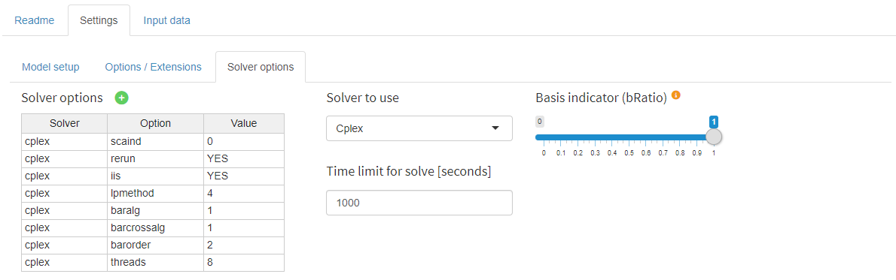
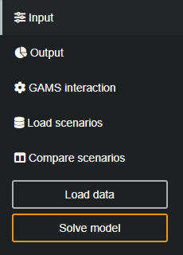
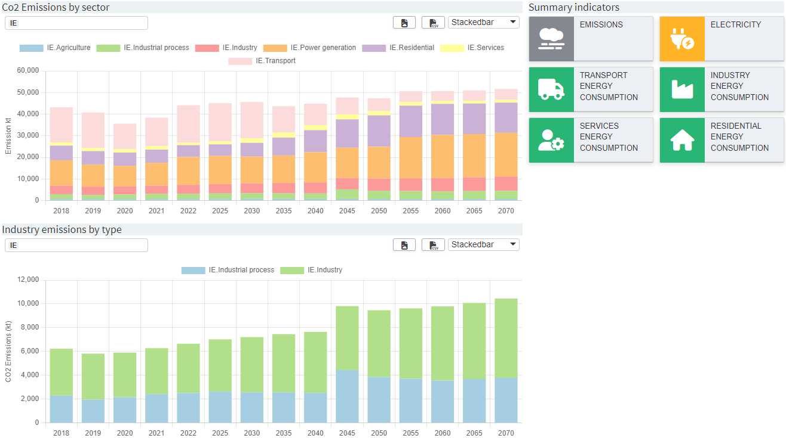
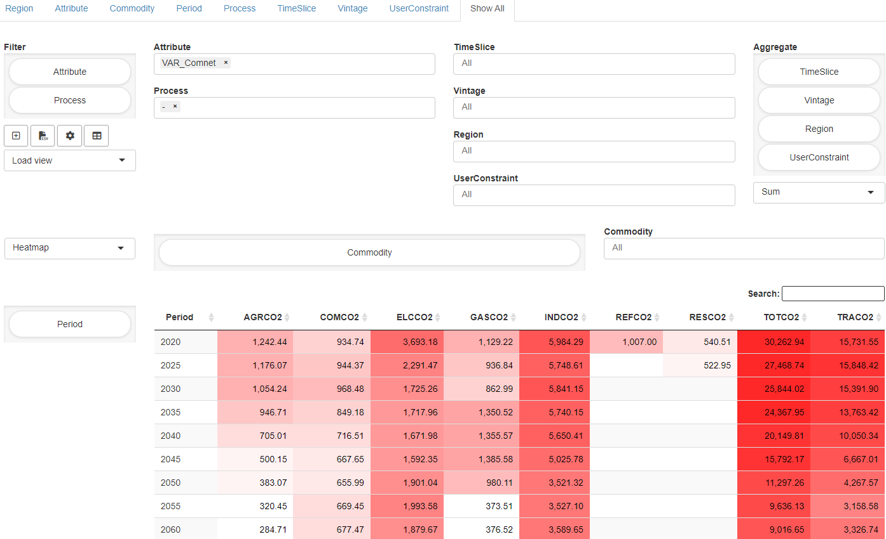

# TIMES MIRO App<a name="times_miro-app"></a>
This is a [GAMS MIRO](https://gams.com/miro) app for the [IEA-ETSAP TIMES](https://github.com/etsap-TIMES/TIMES_model) model.
TIMES MIRO is seen as an open source platform primarily intended to promote the dissemination and use of existing TIMES models. 
It allows users to make changes to model assumptions and perform sensitive runs based on the initial model assumptions. 
It then facilitates the comparison of results across multiple scenarios to evaluate the impact of the alternate futures. 
The app comes with predefined TIMES MIRO Scenarios, e.g. the [TIMES_Demo](https://github.com/etsap-TIMES/TIMES_Demo) (default) 
and the the [TIMES-DK\_COMETS](https://github.com/energy-modelling-club/TIMES-DK_COMETS) data sets. 
Others can be created from TIMES model Excel input files (\*.xlsx) or \*.dd files.


To obtain the app, including the TIMES source from the [TIMES_model](https://github.com/etsap-TIMES/TIMES_model) repository 
plus the [TIMES_Demo](https://github.com/etsap-TIMES/TIMES_Demo) and the the 
[TIMES-DK\_COMETS](https://github.com/energy-modelling-club/TIMES-DK_COMETS) data sets, run the following command:
> git clone --recurse-submodules https://github.com/GAMS-dev/TIMES_MIRO.git

# Prerequisites<a name="prerequisites"></a>
In order to use the TIMES MIRO app locally you need
* to clone this repository or download the self contained *.miroapp file(s) (https://github.com/GAMS-dev/TIMES_MIRO/releases)
* to install GAMS 31.2.0 or newer (https://www.gams.com/download/)
* to install GAMS MIRO 2.9.0 or newer (https://www.gams.com/miro/download.html)

**Note:** Starting the app locally for the first time may take some time because the predefined scenario data sets have to be imported to the MIRO database.

To be able to import TIMES model Excel input files in MIRO, [python](https://www.python.org/) and the python package 
[xl2times](https://github.com/etsap-TIMES/xl2times) are required. The Excel input format accepted by this tool is documented 
in the [TIMES Model Documentation PART IV](https://iea-etsap.org/docs/Documentation_for_the_TIMES_Model-Part-IV.pdf). Make 
sure that python can be found by putting it in the [PATH](https://en.wikipedia.org/wiki/PATH_(variable)) environment variable.

# Example Application with Customized Visualizations
If the TIMES MIRO application is used without further ado, the output section shows all model results in a powerful pivot table 
(generated by [GDX2VEDA](https://www.gams.com/latest/docs/T_GDX2VEDA.html)) that 
allows slicing and dicing the data as needed. In addition to a table, the renderer also supports the visualization of 
data in the form of a heatmap or as a chart (line chart, bar chart, etc.). 

With a configuration adapted to your model, you can significantly improve the visualization of the results in the form of a 
dashboard and/or a so-called data explorer, both in the regular output section and as a separate scenario comparison module. 
You can find more details about the renderers [below](#output-view).

These renderers must be configured for the specific data of the model used. To make it easier to get started, this repository 
includes a slimmed-down version of the [TIMES Ireland model](https://github.com/MaREI-EPMG/times-ireland-model) that has 
already been configured for use with the dashboard and data explorer. The files can be found in the `example` folder and must 
be moved to the correct location in order to use the TIMES/MIRO app for the TIMES Ireland model.

- config.json &#8594; move to `renderer_times_miro`
- schema files 
  - Schema.xlsx &#8594; move to `renderer_times_miro`
  - Schema_colors.xlsx &#8594; move to `renderer_times_miro`
  - Schema_Technology.xlsx &#8594; move to `renderer_times_miro`
- views.json &#8594; move to `conf_times_miro`
- times_ireland_demo.miroscen &#8594; move to `data_times_miro`

To initialize the use of these files, open the `conf_times_miro/times_miro.json` and change the `dataRendering` entry of the `cubeOutput` symbol from 

```
"dataRendering": {
  "cubeoutput": {
    "outType": "miroPivot",
    "height": 700,
    "options": {
      "aggregationFunction": "sum",
      "pivotRenderer": "table",
      "enableHideEmptyCols": true,
      "hideEmptyCols": true,
      "emptyUEL": "-",
      "rows": ["soname", "sow", "com_grp", "prc", "allyear", "all_reg", "vintage", "all_ts", "uc_n"]
    }
  },
  [...]
}
```

to

```
"dataRendering": {
  "cubeoutput": {
    "outType": "mirorenderer_cubeoutput"
  },
  [...]
 }
```

In the same file make sure that `"customCss": true` is set. If not, add it to the root configuration. 

To enable the custom scenario comparison module, add the following configuration:

```
"customCompareModules": [
  {
    "id": "explorer",
    "label": "Dashboard compare"
  }
]
```

Optionally, one can enable the custom scenario comparison as default comparison module by setting

```
"defCompMode": "explorer"
```

The MIRO app can now be started and the Ireland dataset imported from the database via the `Load data` button. 

# Usage of the App<a name="usage-of-the-app"></a>
Following the common [MIRO App Structure](https://www.gams.com/miro/start.html#miro-structure), the app has a navigation bar 
on the left side to switch between the following views: 
* Input
* Output
* GAMS Interaction
* Load Scenarios
* Compare Scenarios

##  Import Data<a name="import-data"></a>
The input section can be used to prepare data for the next model run. 

### Database Scenarios<a name="import-database-scenarios"></a>
A TIMES MIRO Scenario (all visible data and attachments) can be stored in the database at any 
time as a MIRO scenario for later use under `Scenario` &rarr; `Save as`. To load an existing 
scenario from the database, click the `Load data` button in the input view. In the dialog that 
opens, the `Database` tab lists all available scenarios. If there are many saved scenarios, 
the [Load scenarios view](#load-scenarios) can give a better overview. 


<br />

### Local File Scenarios<a name="import-local-file-scenarios"></a>
Scenario files previously exported from MIRO can be re-imported via the `Local` tab in the same dialog. 

### External Scenarios<a name="import-external-scenarios"></a>
New data can be imported via the `External` tab. Either TIMES model Excel input files (\*.xlsx) or \*.dd files can be used as data source. Optionally, it is 
possible to provide a \*.run file as produced by 
[VEDA](https://iea-etsap.org/index.php/etsap-tools/data-handling-shells/veda). The data must be 
zipped (file paths can remain) and uploaded via the fileinput widget. 
Click on `Load` to start the data import. As soon as this is finished, MIRO will inform you whether the import was successful. 


---
**NOTE**

To be able to import Excel input files, [python](https://www.python.org/) and the python package 
[xl2times](https://github.com/etsap-TIMES/xl2times) are required. The Excel input format accepted by this tool is documented 
in the [TIMES Model Documentation PART IV](https://iea-etsap.org/docs/Documentation_for_the_TIMES_Model-Part-IV.pdf). Make 
sure that python can be found by putting it in the [PATH](https://en.wikipedia.org/wiki/PATH_(variable)) environment variable.

---

The following happens when importing data via the `External` tab:

- XLSX: If .xlsx files are provided as input data, the python tool [xl2times](https://github.com/etsap-TIMES/xl2times) is first 
called in the background, which converts these files into \*.dd files (`output.dd` and `ts.dd`). In the next step, 
GAMS is called to convert these \*.dd files into MIRO-compatible input data. 
- DD: If \*.dd files are provided as input data, GAMS is directly called to convert the \*.dd files into MIRO-compatible input data.

If a (optional) run file is used in any of these cases, the MIRO input data will be completed by automatically extracting TIMES 
extensions, active \*.dd files, etc. from the \*.run file. Note that this approach is convenient but also fragile because if the 
\*.run file contains unexpected content, things might fail. You should therefore ensure that the content of the run file is 
compatible with the data provided.

**Milestone years**

The representative years for the model periods are taken from different sources depending on the input files used. 
- If TIMES model Excel input files (.xlsx) files are imported, the milestone years are always extracted from them, regardless of any .run file that may have been provided.
- If .dd files are imported together with a run file, the milestone years are extracted from the run file. There must be no `milestonyr` entry in the dd files. 
- If .dd files are imported without a run file, the milestone years are set to the default: `2005, 2010, 2015, 2020, 2030, 2050`. There must be no `milestonyr` entry in the dd files. 

## Prepare Model Run<a name="prepare-model-run"></a>

In the `Settings` tab the main configuration is done. There are three sections: `Model setup`, 
`Options / Extensions` and `Solver options`.

### Model Setup
- `DD Files order / Read under $offEps`: In this table, the names of all \*.dd files that belong to the current TIMES MIRO scenario are listed. The user can adjust the read order and specify whether a \*.dd file should be read in GAMS under `$offEps`. If a \*.dd file should not be used for the next model run, this can be specified by an order value of `0`. Note that the [xl2times](https://github.com/etsap-TIMES/xl2times) tool, which is used when [importing xlsx files](#import-external-scenarios), only generates 2 \*.dd files as output.
- `Milestone years`: This table allows to select the set of years for which the model will run.
- `Time slices available`: This table cannot be edited by the user, but only serves as an overview of the available time slices in the data. The set of timeslices and the representation of the intra-annual resolution is pre-configured and of central importance to many model data structures. A re-configuration of this set would require extensive modifications in the input data cube.
- `Additional statements`: This table allows you to add GAMS code to the run file that is 
generated during the model run. The custom code will be placed before the 
`$batInclude maindrv.mod`. This setting is recommended for expert TIMES users only.


<br />

### Options / Extensions
In this tab, TIMES options/extensions can be configured. A tooltip with a description of the option appears when you hover 
over an option. Each value cell contains a dropdown menu which allows you to select available options. Note that values can 
also be entered manually. 


<br />

### Solver Options
In this tab, the solver to be used and (optional) options can be defined.
- `Solver options`: This table allows to change/define solver options to be used.
- `Solver to use`: Select a solver to use. 
- `Time limit for solve [seconds]`: Time limit for solving the model.
- `Basis indicator (bRatio)`: The value specified for [bRatio](https://www.gams.com/latest/docs/UG_GamsCall.html#GAMSAObratio) will cause a basis to be discarded if the number of basic variables is smaller than bRatio times the number of equations.



### Input data<a name="input-data"></a>
This is the central tab for browsing and editing input data in a powerful pivot table. The concept of this tab follows the idea to look at data based on "important" indices (e.g. Region, Year, Process, Commodity, Time Slice, ...). Each dimension of the cube can be filtered, aggregated, dragged into the columns, etc. using drag and drop. The cells are editable. Note, however, that when a dimension of the cube is in the `Aggregate` field, the table is read-only. More information about the pivot tool in general can be found [here](https://www.gams.com/miro/charts.html#pivot-chart).


<br />

### RES viewer<a name="res-viewer"></a>
In the upper right corner of the input data tab there is a *switch view* button that allows to look at the RES network. The RES viewer provides `process centric`, `commodity centric` and `user constraint centric` views. All displayed items are clickable which allows convenient switching between different views. The corresponding table at the right and the pivot table at the bottom are updated automatically and show related data.


<br /><br />

### Solve model<a name="solve-model"></a>
When all data has been prepared and settings have been made in the input view, the model can be solved by clicking on the `solve model` button in the navigation bar in the `Input` section.



<br /><br />

## GAMS Interaction View<a name="gams-interaction-view"></a>
The GAMS Interaction View is automatically focused during a run. It shows the log file while it is written. The log and listing file can be accessed after a run. Note that the listing file shown in the app is a combination of the listing files written when running the wrapper `times_miro.gms` and the driver `timesdriver.gms`. You can find more information about the underlying code structure [here](https://github.com/GAMS-dev/TIMES_MIRO#code-structure).

For more details on this view, please consult the [GAMS MIRO Documentation](https://www.gams.com/miro/start.html#miro-structure).

## Output View<a name="output-view"></a>
Once a TIMES model has been solved, the Output view is filled with results data (generated by [GDX2VEDA](https://www.gams.com/latest/docs/T_GDX2VEDA.html)).

If the TIMES MIRO application is used without further ado, the output section shows data in a powerful pivot table that allows slicing and dicing the results as needed. In addition to a table, the renderer also supports the visualization of data in the form of a heatmap or as a chart (line chart, bar chart, etc.). The MIRO pivot table renderer allows you to store "views" - the current representation of the data - to the database and load it together with the scenario data. This is very convenient for views that are frequently needed.

With a configuration adapted to the model, you can significantly improve the results visualization. Up to 4 output screens are available for integration. 

1. __Dashboard__
The dashboard is an interactive tool with different views showing key insight data. The dashboard is navigated via the ‘tiles’ on the right-hand side of the screen. A click on a tile switches the view to configured charts/tables. 

   

2. __Data Explorer__
The data explorer is an interactive tool that provides insights into the most important sectors. You can filter the data based on different indicators and switch between several chart types.
   
     

3. __Data Explorer (Pivot)__
Pivot table that holds the same data as Data Explorer. The pivot table allows you to filter, aggregate and pivot data freely. 
   
     
 
4. __Full Output__
Pivot table that holds all output data. Similar to the Input data, the concept of the data in the Full Output tab follows the idea to look at data based on "important" indices (e.g. Region, Attribute, Commodity, Process, Time Slice, …). 

     

## Load Scenarios <a name="load-scenarios"></a>
`Load scenarios` provides a powerful batch load module that graphically assists you to create and execute complex database queries. Filters can be applied to scenario metadata such as the creation time, scenario name, or optional tags you have assigned to a scenario. You can also filter by any input and output scalars defined in your model as well as any [double-dash parameters](https://www.gams.com/latest/docs/UG_GamsCall.html#UG_GamsCall_DoubleDashParametersEtc) and GAMS [command line parameters](https://www.gams.com/latest/docs/UG_GamsCall.html#UG_GamsCall_ListOfCommandLineParameters). You can combine any of these filters with the logical operators AND and OR. You can execute your query by clicking on the Fetch results button. After the results have been retrieved, the page will be updated and you will see a table with the scenarios that correspond to your query. Once you have found the scenarios you were looking for, you can select them and, for example, [compare them](#compare-scenarios-view) or load them into the sandbox for editing. More information about this in the [official MIRO documentation](https://www.gams.com/miro/start.html#scenario-loading).

## Compare Scenarios <a name="compare-scenarios-view"></a>

This section can be used to compare MIRO scenarios that are stored in the database. There are three different types of comparison available per default: `Split view`, `Tab view` and `Pivot view`. 
In the `split view` comparison the data of two scenarios can be compared side by side. Scenarios can also be loaded into tabs (as you know it from e.g. your internet browser) in the `tab view` comparison. This allows to compare more than two scenarios. In the `pivot view` comparison the data of all selected scenarios is merged into a pivot table which allows to create charts that combine data from multiple scenarios.

Once the configuration for the output renderers (see below) has been completed, the dashboard and the data explorer tab can also be used in a custom scenario comparison module without much additional effort. In such a module, all data of several selected scenarios is visualized in the renderers at once:

  

You can find more information on custom scenario comparison in MIRO [here](https://www.gams.com/miro/configuration_json_only.html#custom-compare-mode).

# Output configuration
Please note that the configuration discussed below is very data-specific and tailored to a particular model (e.g. TIMES Ireland). It is therefore likely that an application configured for Model X will not work with data from Model Y. 

Most of the configuration of the output is done in the file `renderer_times_miro/config.json`. This file is divided into several sections:
- `generalConfig`: General configuration
- `dataProcessing`: Conditions for excluding specific data points from the results.
- `dataExplorer`: Configuration for the data explorer tab
- `dashboard`: Configuration for the dashboard tab

Make sure that correct json syntax is used and that upper/lower case is respected. 

To initialize the use of the `config.json`, open the `conf_times_miro/times_miro.json` and change the `dataRendering` entry of the `cubeOutput` symbol from 

```
"dataRendering": {
  "cubeoutput": {
    "outType": "miroPivot",
    "height": 700,
    "options": {
      "aggregationFunction": "sum",
      "pivotRenderer": "table",
      "enableHideEmptyCols": true,
      "hideEmptyCols": true,
      "emptyUEL": "-",
      "rows": ["soname", "sow", "com_grp", "prc", "allyear", "all_reg", "vintage", 
               "all_ts", "uc_n"]
    }
  }
}
```

to

```
"dataRendering": {
  "cubeoutput": {
    "outType": "mirorenderer_cubeoutput"
  }
 }
```

In the same file make sure that `"customCss": true` is set. If not, add it to the root configuration. 

## generalConfig (General Configuration)
General configuration in the `renderer_times_miro/config.json` file.

### tabNames
Defines names for main output tabs in the application. If a tab name is missing, the corresponding tab will be hidden in the user interface. This is also true for the optional scenario comparison module. 
For the `dataExplorerPivot` tab to be used, the main [dataExplorer](#dataexplorer) configuration (not `tabNames.dataExplorer`) needs to be available. 

Example:
```
"tabNames": {
  "dashboard": "Dashboard",
  "dataExplorer": "Data Explorer",
  "dataExplorerPivot": "Data Explorer (Pivot)",
  "fullOutput": "Full Output"
}
```

## dataProcessing (Data Processing)

### excludeNonNumericPeriods
Indicates whether rows with non-numeric period values should be excluded from the results data.

Example: 

```
"excludeNonNumericPeriods": true
```

### skip
Description: Specifies conditions for excluding specific data points from the results.

Example:

```
"skip": { 
  "Period": [2016, 2018], 
  "Commodity": ["COseq"] 
}
```

## dashboard (Dashboard)<a name="dashboard"></a>
The dashboard configuration takes place exclusively in `renderer_times_miro/config.json`. All configurations made in this section apply exclusively to the dashboard tab. This includes:
- Configuration of the tiles (value boxes), which are used to navigate between views in the dashboard. Optionally, value boxes can display KPIs.
- Configuration of the view to be displayed when clicking on a value box. A view can contain several charts/tables.
- Configuration of the individual charts/tables.

### valueBoxesTitle
Title to be displayed above the value boxes section in the dashboard.

Example: 
```
"valueBoxesTitle": "Summary indicators"
```

### valueBoxes<a name="valueBoxes"></a>
Configuration for the value boxes (tiles) in the dashboard. A valuebox can display a title and a single value (optional). As a value box is linked to a view, the title/value should be selected according to this. A valuebox has several properties that can be configured. Each property of each value box must always be specified so that all property lists have the same number of entries. An example will be given below
- Id: Each valuebox needs a unique id. The id of a dataview with charts and tables (see below) is linked to the id of a valuebox. This can be any string. 
- Color: A valuebox can have an individual color. The color code can either be provided as Hex Color Code (e.g. `#29B675`) or can be chosen from the following options: `red`, `yellow`, `aqua`, `blue`, `light-blue`, `green`, `navy`, `teal`, `olive`, `lime`, `orange`, `fuchsia`, `purple`, `maroon`, `black`.
- Icon: A valuebox can have an individual icon. For all available icons see [fontawesome.com](https://fontawesome.com/search?o=r&m=free).
- Title: Title that is displayed in the valuebox.
- ValueScalar: If the value box should display a value, this needs to be configured here. Valid ValueScalar entries are scalar output symbols of the model, which are integrated in MIRO. Names must be specified in the lowercase. 
- Prefix: String that is displayed ahead of the value. If `+` is defined as a prefix, a `+` is appended to a positive value. If the value is negative, the sign automatically changes to `-`.
- Postfix: String that is displayed after the value.
- redPositive: Positive values are displayed in green by default, negative values in red. If this logic should be reversed (positive: red, negative: green), the redPositive property of the valuebox must be set to true, otherwise false. 
- NoColor: If the value of the valuebox should not have a red/green color, but should be gray instead, the NoColor property needs to be set to true, else false.
- Decimals: Number of decimal places that should be displayed for a value.

Example:
```
 "valueBoxes": {
   "Id": ["allEmissions", "transportEnergy"],
   "Color": ["#848991", "#29B675"],
   "Icon": ["smog", "truck"],
   "Title": ["All Emissions", "Transport energy consumption"],
   "ValueScalar": [null, null],
   "Prefix": ["+", "+"],
   "Postfix": ["%", "%"],
   "redPositive": [false, false],
   "NoColor": [false, false],
   "Decimals": [null, null]
 }
```

### dataViews<a name="dataViews"></a>
A data view is shown if  the corresponding value box is clicked in the user interface. It can display multiple charts and tables. In `dataViews` you define how many charts/tables a view should contain. The actual configuration of the charts/tables is done in [dataViewsConfig](#dataViewsConfig) (see below). 
The name/id of a data view must match the id of a valuebox. This represents the link between the valuebox and the view. After the name/id, the title is specified, which is displayed above the chart/table. 
If only one chart is specified for a view, the chart and corresponding table of the data set are displayed one below the other. If there is more than 1 chart per view configured, you can choose between chart and table via dropdown in the dashboard.

In the following example two data views are configured. The ids (`allEmissions` and `transportEnergy`) match the ones used for the [valueBoxes](#valueBoxes) (see above). The `allEmissions` view will show two charts/tables, the `transportEnergy` view will show one.

Example: 

```
"dataViews": {
  "allEmissions": {
    "allEmissions": "All Energy Related Annual Emissions",
    "IndustryEmissions": "Industry emissions"
  },
  "transportEnergy": {
    "transportEnergy": "Transport final energy consumption?"
  }
}
```

### dataViewsConfig<a name="dataViewsConfig"></a>
The individual charts/tables are configured for specific data here. A separate configuration in `dataViewsConfig` is required for each chart listed in the `dataViews`. The ids need to be the same. 

A data view configuration describes how the original data should be filtered, pivoted, aggregated and which renderer should be used. The configuration of a chart is almost the same as that of a configured view in the pivot table (learn more about views [here](https://www.gams.com/miro/start.html#metadata-views) and [here](https://www.gams.com/miro/charts.html#pivot-chart)). The easiest way to configure a dashboard chart is therefore as follows: 

1. Start the app, load scenario data with results data (or solve first).
2. Navigate to the full output pivot table tab in the output section
3. In the pivot table, slice and dice data as desired, select a renderer and save the whole thing as a view by clicking on the `+`  on the left side of the pivot table. 
4. Click on `Scenario` → `Edit metadata` in the top right corner of the app and switch to the `View` tab in the dialog box that opens.
5. Select the configured view (or several views) by clicking on it and click on `Download views`.
6. Open the downloaded json file and unminify the contents if necessary (e.g. via [unminify.com](https://unminify.com/)). 
7. Many settings of a view (marked green below) can be copied 1:1 for the configuration of a chart in the dashboard. 
8. In addition to the attributes of the downloaded pivot-table view, there are further attributes available in the dashboard configuration: 
    1. `customLabels`: Listing of individual elements that should be relabeled in the chart/table. Note that applying custom labels to a dataset can be compute-intensive depending on the amount of data. Rendering the output might increase significantly. 
    2. `userFilter`: Adds multi-dropdown menu(s) to a chart/table in which elements of the configured dimension can be selected for being rendered. 
    3. `Decimals`: Number of decimal places to be displayed

```
"dataViewsConfig": {
  "allEmissions": {
    "rows": ["Period"],
    "filter": { "Attribute": "VAR_Comnet", "Process": "-", "UserConstraint": "-", "Vintage": "-" },
    "aggregations": { "all_ts": null },
    "aggregationFunction": "sum",
    "cols": { "Region": null, 
              "Commodity": ["AGRCO2", "COMCO2", "INDCO2", "RESCO2", "TRACO2"] },
    "tableSummarySettings": { "enabled": false, "rowSummaryFunction": "sum", "colSummaryFunction": "sum" },
    "pivotRenderer": "stackedbar",
    "chartOptions": { "yTitle": "CO2 Emissions",
                      "customLabels": {
                        "NI": "North Island",
                        "SI": "South Island",
                        "AGRCO2": "Agriculture",
                        "COMCO2": "Commercial",
                        "INDCO2": "Industry",
                        "RESCO2": "Residential",
                        "TRACO2": "Transport"
                      } 
    },
    "userFilter": "Region",
    "decimals": 2
    }
}
```

## dataExplorer (Data Explorer)<a name="dataexplorer"></a>
All configurations made in this section apply exclusively to the Data explorer tab.

### schemaFiles
Specifies three schema files for the data explorer tab. 
- `dataSchema`: This schema is mandatory if the data explorer tab is used. It maps Attribute/Process/Commodity combinations to a Sector, Subsector, Technology, Fuel, Enduse, Unit, Parameter and Fuel group. 
  The data schema must include the following column names: `Attribute`, `Process`,	`Commodity`, `Sector`, `Subsector`,	`Technology`, `Fuel`, `Enduse`, `Unit`, `Parameters`, `FuelGroup`. These are also the column names that form the basis for further modifications in the `dataExplorer` section. 
- `technologySchema`: This schema is mandatory if the data explorer tab is used. It maps Technologies (as used in dataSchema, column ‘Technology’) to technology groups. The data schema must include the following column names: `Technology`, `Technology_Group`.
- `colorSchema`: Optional schema. It maps Technologies (as used in `dataSchema`, column `Technology`) to colors and symbols (for data points in a chart) that are then used in the data explorer tab. If no schema is specified, default colors and symbols are used. Possible symbols are  `circle`, `cross`, `crossRot`, `dash`, `line`, `rect`, `rectRounded`, `rectRot`, `star`, `triangle`.

```
Example:
"schemaFiles": {
  "dataSchema": "Schema.xlsx",
  "technologySchema": "Schema_Technology.xlsx",
  "colorSchema": "Schema_colors.xlsx"
}
```

### tabNames
Defines names and metadata for sector tabs in the data explorer. For each tab name/sector provided there will be a tab in the data explorer. For a tab name, the string under which the sector can be found in the Sector column in the output data (as used in `dataSchema`, column `Sector`) must be provided. An optional tooltip can be added that will be shown in the interface when hovering a tab.
Note that if a sector string is changed via the [mutateColumns](#mutateColumns) configurations (see below), the new value needs to be used here. 
Example: 

```
"tabNames": {
  "All Sectors": { 
    "dataString": null, 
    "tooltip": "" 
  },
  "Transport": { 
    "dataString": "Transport", 
    "tooltip": "" 
  },
  "Electricity": { 
    "dataString": "Other", 
    "tooltip": "Electricity Generation"
  }
}
```


### nonEmissionFuel
Specifies non-emission fuels for analysis. In addition to fuels (as used in `dataSchema`, column `Fuel`) that are declared as non-emission fuels, the parameter that represents emissions (as used in `dataSchema`, column `Parameters`) must also be specified. As a result, the emission value of the specified fuels is set to `0` in the result data.
Example:

```
"nonEmissionFuel": {
  "fuels": ["Electricity", "Wood", "Hydrogen", "Hydro", "Wind", "Solar", "Biogas"],
  "emissionParameter": "Emissions"
}
```


### mutateColumns <a name="mutateColumns"></a>
Defines rules for mutating or transforming specific columns in the results data. Each rule has a condition column with a condition, a target column and a new value that should be applied. Column names correspond to the ones in `dataSchema`.

Example:
In the following example there are three mutations defined. 
- In the first one all `Electricity` entries in the `Sector` column should be renamed to `Other`.
- The second modification looks into column `Parameters`. Whenever there is an `Emissions` entry in that column, the value of that row (column `Value`) should be divided by 1000.
- The third change is a consequence of the second one. Wherever there is an `Emissions` entry in the `Parameters` column, the unit (column `Unit`) should be changed to `Mt CO2/yr` (was `kt CO2/yr` before).

```
"mutateColumns": [
  {
    "targetColumn": "Sector",
    "conditionColumn": "Sector",
    "condition": "Electricity",
    "newValue": "Other"
  },
  {
    "targetColumn": "Value",
    "conditionColumn": "Parameters",
    "condition": "Emissions",
    "newValue": "Value/1000"
  },
  {
    "targetColumn": "Unit",
    "conditionColumn": "Parameters",
    "condition": "Emissions",
    "newValue": "Mt CO2/yr"
  }
]
```

### removeData
Defines rules for excluding specific data entries in the results data. Each rule has a target column with a condition. Column names correspond to the ones in `dataSchema`.

Example: 
In the following example there are two deletions defined.
- In the column `Parameters` all rows with the entry `Annualised Capital Costs` should be removed.
- In the column `Parameters` all rows with the entry `Technology Capacity` should be removed.

```
"removeData": [
  {
    "targetColumn": "Parameters",
    "condition": "Annualised Capital Costs"
  },
  {
    "targetColumn": "Parameters",
    "condition": "Technology Capacity"
  }
]
```

### preprocessing
In case the available options to mutate or remove data is not sufficient, one can include an additional R file for cleaning and preprocessing data for the data explorer further. In the output renderer file `mirorenderer_cubeoutput.R`, the preprocessing file is included right after the (optional) data mutations (`mutateColumns`, `removeData`). The data tibble that needs to be used is named `clean_df`. Resulting data must be named `explorer_df` and needs to have the columns `Sector`, `Subsector`, `Technology`, `Enduse`, `Unit`, `Parameters`, `Fuel`, `Period`, `FuelGroup`, `Technology_Group`, `Value`. The preprocessing file needs to be located in `renderer_times_miro/data-processing`.

Example: 
```
"preprocessing": "data-cleaning.R"
```

# Scenario comparison configuration
To initialize the custom scenario comparison module, open the `conf_times_miro/times_miro.json` and add the following configuration:

```
"customCompareModules": [
  {
    "id": "explorer",
    "label": "Dashboard compare"
  }
]
```

In the same file make sure that 

```
"customCss": true 
```

is set. If not, add it to the root configuration. Optionally, one can enable the custom scenario comparison as default comparison module by setting

```
"defCompMode": "explorer"
```

## scenCompareDashboard (Scenario Comparison Dashboard)
_Same structure as dashboard section._


Note on `scenCompareDashboard.dataViewsConfig`:

As the result data in the scenario comparison has an additional `Scenario` dimension, it is advisable to use the [pivot compare mode](https://www.gams.com/miro/start.html#compare-pivot) for the chart configuration.

1. Start the app.
2. Go to section ‘Load Scenarios’ in the navigation pane and search for desired scenarios
3. Select scenario(s) by clicking on them, click on ‘Choose selected scenarios’ and in the modal dialog that opens select ‘Compare (Pivot)’ as comparison module.
4. Continue with step 3. in [dataViewsConfig](#dataViewsConfig) from the previous section.


## scenCompareDataExplorer (Scenario Comparison Data Explorer)
_Same structure as dataExplorer section._ 


# Code Structure<a name="code-structure"></a>
The basic principle of the TIMES MIRO app is that it works as a wrapper around the existing TIMES source code and the well established data handling concept that feeds the model with data via so-called \*.dd files.

The code sections referred to in the following overview are highlighted via corresponding comments in the wrapper file `times_miro.gms`. Also note that there is difference between running the file through the app (this is what happens in the background when the user hits "solve") and running it through Studio. Running the file through studio is mainly useful to prepare new TIMES data sets for usage with the app. To do so, run 

>times_miro.gms --RUNMODE=create --RUNFILE=<path/to/runfile.run> --DDPREFIX=<path/to/ddFiles/>

where you replace `<path/to/runfile.run>` by a locally available \*.run file and replace `<path/to/ddFiles/>` by a local folder that contains all the relevant \*.dd files (**make sure to provide the final directory separator!!!**).


# Support
If you have any questions or comments regarding the TIMES/MIRO app, please contact support@gams.com.


# License<a name="license"></a>
The MIRO demo app is licensed under the MIT license (see file LICENSE). Note that everything inside the times\_model, TIMES\_Demo as well as the TIMES-DK_COMETS submodules is licensed under GPL-3. See files `times_model\LICENSE.txt`, `TIMES_Demo\LICENSE.txt` as well as `TIMES-DK_COMETS\LICENSE` for more information.
The data processing and data explorer code in the custom renderer files was taken from https://github.com/EECA-NZ/TIMES-NZ-Visualisation (MIT licensed, see [here](https://github.com/EECA-NZ/TIMES-NZ-Visualisation/blob/master/LICENSE)). The code has been modified to meed the requirements of this application.