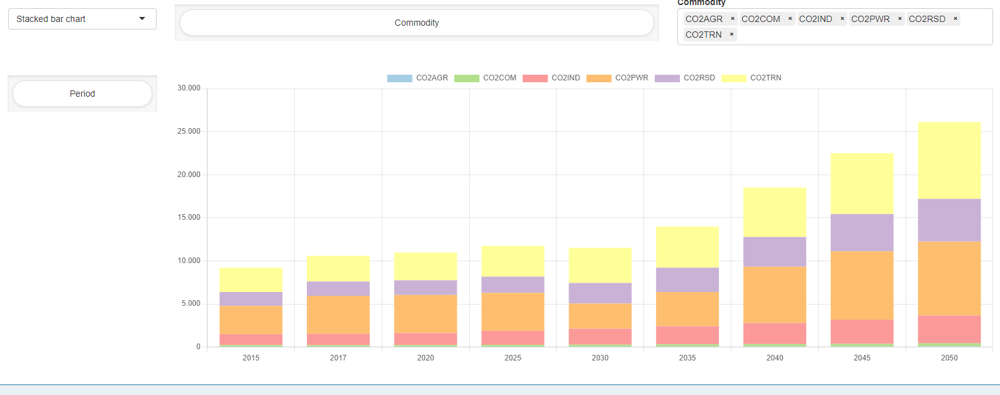

Table of Contents
=================

   * [TIMES MIRO App](#times_miro-app)
      * [Input View](#input-view)
          * [Settings](#settings)
          * [Create input data](#create-input)
          * [Prepare model run](#prepare-model-run)
          * [Input data](#input-data)
      * [Output View](#output-view)
      * [GAMS Interaction View](#gams-interaction-view)
      * [Load Scenarios View](#load-scenarios-view)
      * [Compare Scenarios View](#compare-scenarios-view)
   * [License](#license)

## Usage of the App
This is a [GAMS MIRO](https://gams.com/miro) app for the [IEA-ETSAP TIMES](https://github.com/etsap-TIMES/TIMES_model) model. It allows the user to load different data sets, to set TIMES options, to manipulate input data and to analyze output data. 

The app comes with two predefined data sets, the [TIMES_Demo](https://github.com/etsap-TIMES/TIMES_Demo) data set (default) and the the [TIMES-DK\_COMETS](https://github.com/energy-modelling-club/TIMES-DK_COMETS) data set. Other data sets can be created from \*.dd files (see [below](#create-input)).

The app follows the common [MIRO App Structure](https://www.gams.com/miro/start.html#miro-structure) with a navigation bar on the left side to switch between the following views:
* Input View
* Output View
* GAMS Interaction View
* Load Scenarios View
* Compare Scenarios View 

The navigation bar also contains a solve button that allows to start a run based on settings and data specified in the input view.

### Input View / Job setup
The input view is organized two main tabs which are described below. 

#### Settings
> **_NOTE:_**  Depending on which of the two sub-tabs `Prepare model run` and `Create input data` you are in, clicking on 'Solve Model' will start different processes. 

##### Create input data
The MIRO app requires a suitable GDX file as input data. If not available, such a GDX file can be generated from within the interface. This can be done under `Create input data` in the settings tab. For the generation of a GDX file the DD files to be used and a RUN file are needed. These must be provided via the corresponding upload fields. If the user hits `Solve Model` while being in the `Create input data` tab an input cube will be created from the \*.dd files provided by the user and a TIMES scenario will be defined by automatically extracting TIMES extensions, active \*.dd files, etc. from the \*.RUN file. Note that this approach is convenient but also fragile because if the RUN file contains unexpected content, things might fail. When the process is complete, the GDX file is attached to the current MIRO scenario. Under Scenario &rarr; edit metadata &rarr; attachments you will find a miroScenario.gdx. Click on the file to download it. 

##### Prepare model run
In the `Prepare model run` tab the main configuration for the next model run is done. Since most of the settings should be self explaining only some of them are explained below.

`DD Files order / Read under $offEps`:  

In this table the names of all dd files are listed. The user can adjust the read order and specify whether a dd file should be read in GAMS under `$offEps`. If a dd file should not be used for the next model run, this can be specified by an order value of '0'. 

`Extensions`:  

This table allows to enable/disable several TIMES extensions.

`Time slices available`:

This table cannot be edited by the user, but only serves as an overview of the available time slices in the data. The set of timeslices and the representation of the intra-annual resolution is pre-configured and of central to many model parameters. A re-configuration of this set would require extensive modifications in the input parameters.

`Years for model run`:

This table allows to select the set of years for which the model will run. Those years are often referred to as *milestone years*.

`Solver options`:

This table allows to change/define solver options to be used.

#### Input data
This is the central tab for browsing and editing input data in a powerful pivot table view. The concept of this tab follows the idea to look at data based on "important" indices (e.g. Region, Year, Process, Commodity, Time Slice, ...).

In the upper right corner there is *switch view* button that allows to look at the RES network:

### Output View
Once a TIMES model has been solved by clicking the *Solve Model* button, the Output view is filled with data from that solve.
Similar to the Input data, the concept of this tab follows the idea to look at data based on "important" indices (e.g. Region, Year, Process, Commodity, Time Slice, ...). The cube is generated with the help of the tool [GDX2VEDA](https://www.gams.com/latest/docs/T_GDX2VEDA.html).
Output data can be browsed in a powerful pivot table or in a standard table view. Views can be switched by the button in the upper right corner

The output view also provides basic charting facilities. Supported chart types are:
* heatmap
* bar chart
* stacked bar chart
* line chart
* scatter chart
* area chart
* stacked area chart
* radar chart

### GAMS Interaction View
The GAMS Interaction View is automatically focused during a run. It shows the log file while it is written. The log and lst file can be accessed after a run. Note that the lst file shown in the app is a combination of the lst files written when running the wrapper `times_miro.gms` and the driver `timesdriver.gms`.

For more details on this view, please consult the [GAMS MIRO Documentation](https://www.gams.com/miro/start.html#miro-structure).

### Load Scenarios View
`Load scenarios` provides a powerful Batch Load module that graphically assists you create and execute complex database queries. Filters can be applied to scenario metadata such as the creation time, scenario name, or optional tags you have assigned to a scenario. You can also filter by any input and output scalars defined in your model as well as any Double-dash parameters and GAMS options. You can combine any of these filters with the logical operators AND and OR. You can execute your query by clicking on the Fetch results button. After the results have been retrieved, the page will be updated and you will see a table with the scenarios that correspond to your query. Once you have found the scenarios you were looking for, you can select them and, for example, compare them.

### Compare Scenarios View

This view can be used to compare MIRO scenarios that are stored in the database. There are three different types of comparison available, split view, tab view and pivot view mode. In the split view comparison the data of two scenarios can be compared side by side. Scenarios can also be loaded into tabs (as you know it from e.g. your internet browser) in the tab view comparison. This allows to compare more than two scenarios. In the pivot view comparison the data of all selected scenarios is merged into one powerful pivot table.

# License
The MIRO demo app is licensed under the MIT license (see file LICENSE). Note that everything inside the times\_model, TIMES\_Demo as well as the TIMES-DK_COMETS submodules is licensed under GPL-3. See files `times_model\LICENSE.txt`, `TIMES_Demo\LICENSE.txt` as well as `TIMES-DK_COMETS\LICENSE` for more information.
