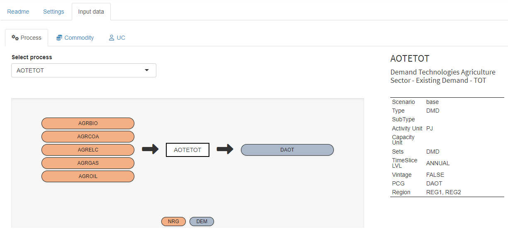

# TIMES - The Integrated MARKAL-EFOM System

This is a [GAMS MIRO](https://gams.com/miro) app for the [IEA-ETSAP TIMES](https://github.com/etsap-TIMES/TIMES_model) model. 
The TIMES (The Integrated MARKAL-EFOM System) model generator was developed by ETSAP the Energy Technology Systems Analysis
 Program, which is a Technology Cooperation Program of the International Energy Agency. ETSAP is an international community 
 which uses long term energy scenarios to conduct in-depth energy and environmental analyses. The TIMES model generator 
 combines two different, but complementary, systematic approaches to modelling energy: a technical engineering approach and 
 an economic approach. TIMES is a technology rich, bottom-up model generator, which uses linear-programming to produce a 
 least-cost energy system, optimized according to a number of user constraints, over medium to long-term time horizons. In a 
 nutshell, TIMES is used for, "the exploration of possible energy futures based on contrasted scenarios" (Loulou et al., 2005).

TIMES MIRO is seen as an open source platform primarily intended to promote the dissemination and use of existing TIMES models. 
It allows users to make changes to model assumptions and perform sensitive runs based on the initial model assumptions. 
It then facilitates the comparison of results across multiple scenarios to evaluate the impact of the alternate futures. 
The app comes with predefined TIMES MIRO Scenarios, e.g. the [TIMES_Demo](https://github.com/etsap-TIMES/TIMES_Demo) (default) 
and the the [TIMES-DK\_COMETS](https://github.com/energy-modelling-club/TIMES-DK_COMETS) data sets. 
Others can be created from \*.xlsx files or \*.dd and \*.run files (see [below](#import-data)).

 

Following the common [MIRO App Structure](https://www.gams.com/miro/start.html#miro-structure), the app has a navigation bar 
on the left side to switch between the following views: 
* Input
* Output
* GAMS Interaction
* Load Scenarios
* Compare Scenarios

##  Import Data
The input section can be used to prepare data for the next model run. 

### Database Scenarios
Input data that is already stored in the integrated database can be loaded via the `load data` 
button. In the dialog that opens, the `Database` tab lists all available scenarios. 

<picture>
  <source srcset="static_times_miro/load_db_dark.png" media="(prefers-color-scheme: dark)">
  
</picture>
 

### Local File Scenarios
Scenario files previously exported from MIRO can be re-imported via the `Local` tab in the same dialog. 

### External Scenarios
New data can be imported via the `External` tab. Either xlsx files or \*.dd files can be used as data source. Optionally, it is 
possible to provide a \*.run file as produced by 
[VEDA](https://iea-etsap.org/index.php/etsap-tools/data-handling-shells/veda). The data must be 
zipped (file paths can remain) and uploaded via the fileinput widget. 
Click on `Load` to start the data import. As soon as this is finished, MIRO will inform you whether the import was successful. 

<picture>
  <source srcset="static_times_miro/load_external_dark.png" media="(prefers-color-scheme: dark)">
  
</picture>

---
**NOTE**

To be able to import .xlsx files, [python](https://www.python.org/) and the python package 
[xl2times](https://github.com/etsap-TIMES/xl2times) are required. The Excel input format accepted by this tool is documented 
in the [TIMES Model Documentation PART IV](https://iea-etsap.org/docs/Documentation_for_the_TIMES_Model-Part-IV.pdf). Make 
sure that python can be found by putting it in the [PATH](https://en.wikipedia.org/wiki/PATH_(variable)) environment variable.

---

The following happens when importing data via the `External` tab:

- XLSX: If xlsx files are provided as input data, the python tool [xl2times](https://github.com/etsap-TIMES/xl2times) is first 
called in the background, which converts these files into \*.dd files (`output.dd` and `ts.dd`). In the next step, 
GAMS is called to convert these \*.dd files into MIRO-compatible input data. 
- DD: If \*.dd files are provided as input data, GAMS is directly called to convert the \*.dd files into MIRO-compatible input data.

If a (optional) run file is used in any of these cases, the MIRO input data will be completed by automatically extracting TIMES 
extensions, active \*.dd files, etc. from the \*.run file. Note that this approach is convenient but also fragile because if the 
\*.run file contains unexpected content, things might fail. You should therefore ensure that the content of the run file is 
compatible with the data provided.

**Milestone years**

The representative years for the model periods are taken from different sources depending on the input files used. 
- If .xlsx files are imported, the milestone years are always extracted from them, regardless of any .run file that may have been provided.
- If .dd files are imported together with a run file, the milestone years are extracted from the run file. There must be no `milestonyr` entry in the dd files. 
- If .dd files are imported without a run file, the milestone years are set to the default: 2005, 2010, 2015, 2020, 2030, 2050. There must be no `milestonyr` entry in the dd files. 

## Prepare Model Run

In the `Settings` tab the main configuration is done. There are three sections: `Model setup`, 
`Options / Extensions` and `Solver options`.

### Model Setup
- `DD Files order / Read under $offEps`: In this table, the names of all \*.dd files that belong to the current TIMES MIRO scenario are listed. The user can adjust the read order and specify whether a \*.dd file should be read in GAMS under `$offEps`. If a \*.dd file should not be used for the next model run, this can be specified by an order value of `0`. Note that the [xl2times](https://github.com/etsap-TIMES/xl2times) tool, which is used when [importing xlsx files](#import-external-scenarios), only generates 2 \*.dd files as output.
- `Milestone years`: This table allows to select the set of years for which the model will run.
- `Time slices available`: This table cannot be edited by the user, but only serves as an overview of the available time slices in the data. The set of timeslices and the representation of the intra-annual resolution is pre-configured and of central importance to many model data structures. A re-configuration of this set would require extensive modifications in the input data cube.
- `Additional statements`: This table allows you to add GAMS code to the run file that is 
generated during the model run. The custom code will be placed before the 
`$batInclude maindrv.mod`. This setting is recommended for expert TIMES users only.

<picture>
  <source srcset="static_times_miro/model_setup_dark.png" media="(prefers-color-scheme: dark)">
  
</picture>

 

### Options / Extensions
In this tab, TIMES options/extensions can be configured. A tooltip with a description of the option appears when you hover 
over an option. Each value cell contains a dropdown menu which allows you to select available options. Note that values can 
also be entered manually. 

<picture>
  <source srcset="static_times_miro/options_extensions_dark.png" media="(prefers-color-scheme: dark)">
  
</picture>

 

### Solver Options
In this tab, the solver to be used and (optional) options can be defined.
- `Solver options`: This table allows to change/define solver options to be used.
- `Solver to use`: Select a solver to use. 
- `Time limit for solve [seconds]`: Time limit for solving the model.
- `Basis indicator (bRatio)`: The value specified for [bRatio](https://www.gams.com/latest/docs/UG_GamsCall.html#GAMSAObratio) will cause a basis to be discarded if the number of basic variables is smaller than bRatio times the number of equations.

<picture>
  <source srcset="static_times_miro/solver_options_dark.png" media="(prefers-color-scheme: dark)">
  
</picture>

---
**Info**  

A TIMES MIRO Scenario (all visible data and attachments) can be stored in the database at any time as a MIRO scenario for later use under `Scenario` &rarr; `Save as`. To load an existing scenario from the database, click the `Load data` button in the input view. If there are many saved scenarios, the [Load scenarios view](#load-scenarios-view) can give a better overview. 

---

### Input data
This is the central tab for browsing and editing input data in a powerful pivot table. The concept of this tab follows the idea to look at data based on "important" indices (e.g. Region, Year, Process, Commodity, Time Slice, ...). Each dimension of the cube can be filtered, aggregated, dragged into the columns, etc. using drag and drop. The cells are editable. Note, however, that when a dimension of the cube is in the `Aggregate` field, the table is read-only. More information about the pivot tool in general can be found [here](https://www.gams.com/miro/charts.html#pivot-chart).

<picture>
  <source srcset="static_times_miro/input_table_dark.png" media="(prefers-color-scheme: dark)">
  
</picture>

 

### RES viewer
In the upper right corner of the input data tab there is a *switch view* button that allows to look at the RES network. The RES viewer provides `process centric`, `commodity centric` and `user constraint centric` views. All displayed items are clickable which allows convenient switching between different views. The corresponding table at the right and the pivot table at the bottom are updated automatically and show related data.

<picture>
  <source srcset="static_times_miro/res_network_dark.png" media="(prefers-color-scheme: dark)">
  
</picture>

  

### Solve model
When all data has been prepared and settings have been made in the input view, the model can be solved by clicking on the `solve model` button in the navigation bar in the `Input` section.

<picture>
  <source srcset="static_times_miro/solve_dark.png" media="(prefers-color-scheme: dark)">
  
</picture>

  

## GAMS Interaction View
The GAMS Interaction View is automatically focused during a run. It shows the log file while it is written. The log and listing file can be accessed after a run. Note that the listing file shown in the app is a combination of the listing files written when running the wrapper `times_miro.gms` and the driver `timesdriver.gms`. You can find more information about the underlying code structure [here](https://github.com/GAMS-dev/TIMES_MIRO#code-structure).

For more details on this view, please consult the [GAMS MIRO Documentation](https://www.gams.com/miro/start.html#miro-structure).

## Output View
Once a TIMES model has been solved, the Output view is filled with results data (generated by [GDX2VEDA](https://www.gams.com/latest/docs/T_GDX2VEDA.html) ). Similar to the Input data, the concept of the output data follows the idea to look at data based on "important" indices (e.g. Region, Year, Process, Commodity, Time Slice, ...). 
The output data can be browsed in a pivot table (read-only) as in the input view or in a standard table. Views can be switched by the button in the upper right corner.

<picture>
  <source srcset="static_times_miro/output_pivot_dark.png" media="(prefers-color-scheme: dark)">
  
</picture>

 
The output view also provides basic charting facilities. Supported chart types are:
* heatmap
* bar chart
* stacked bar chart
* line chart
* scatter chart
* area chart
* stacked area chart
* radar chart
* time series chart

<picture>
  <source srcset="static_times_miro/stacked_bar_chart_dark.png" media="(prefers-color-scheme: dark)">
  
</picture>

## Load Scenarios View
`Load scenarios` provides a powerful batch load module that graphically assists you to create and execute complex database queries. Filters can be applied to scenario metadata such as the creation time, scenario name, or optional tags you have assigned to a scenario. You can also filter by any input and output scalars defined in your model as well as any [double-dash parameters](https://www.gams.com/latest/docs/UG_GamsCall.html#UG_GamsCall_DoubleDashParametersEtc) and GAMS [command line parameters](https://www.gams.com/latest/docs/UG_GamsCall.html#UG_GamsCall_ListOfCommandLineParameters). You can combine any of these filters with the logical operators AND and OR. You can execute your query by clicking on the Fetch results button. After the results have been retrieved, the page will be updated and you will see a table with the scenarios that correspond to your query. Once you have found the scenarios you were looking for, you can select them and, for example, [compare them](#compare-scenarios-view) or load them into the sandbox for editing. More information about this in the [official MIRO documentation](https://www.gams.com/miro/start.html#scenario-loading).

## Compare Scenarios View

This view can be used to compare MIRO scenarios that are stored in the database. There are three different types of comparison available, split view, tab view and pivot view. In the split view comparison the data of two scenarios can be compared side by side. Scenarios can also be loaded into tabs (as you know it from e.g. your internet browser) in the tab view comparison. This allows to compare more than two scenarios. In the pivot view comparison the data of all selected scenarios is merged into a pivot table which allows to create charts that combine data from multiple scenarios.

# License
The MIRO demo app is licensed under the MIT license (see file LICENSE). Note that everything inside the times\_model, TIMES\_Demo as well as the TIMES-DK_COMETS submodules is licensed under GPL-3. See files `times_model\LICENSE.txt`, `TIMES_Demo\LICENSE.txt` as well as `TIMES-DK_COMETS\LICENSE` for more information.