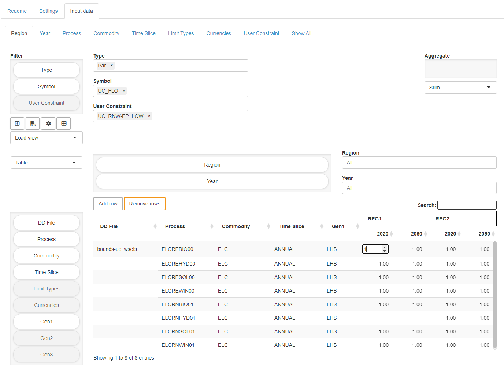

# TIMES MIRO App

   * [Input View / Job setup](#input-view)
       * [TIMES data sets](#times-data-sets)
       * [Create input data](#create-input)
       * [Prepare model run](#prepare-model-run)
       * [Input data](#input-data)
       * [RES viewer](#res-viewer)
       * [Solve model](#solve-model)
   * [GAMS Interaction View](#gams-interaction-view)
   * [Output View](#output-view)
   * [Load Scenarios View](#load-scenarios-view)
   * [Compare Scenarios View](#compare-scenarios-view)
   * [License](#license)

This is a [GAMS MIRO](https://gams.com/miro) app for the [IEA-ETSAP TIMES](https://github.com/etsap-TIMES/TIMES_model) model. It allows the user to load and manipulate different data sets, to set TIMES options, to analyze input and output data, and to compare scenarios. The app comes with predefined data sets, e.g. the [TIMES_Demo](https://github.com/etsap-TIMES/TIMES_Demo) (default) and the the [TIMES-DK\_COMETS](https://github.com/energy-modelling-club/TIMES-DK_COMETS) data sets. Others can be created from \*.dd and \*.run files (see [below](#create-input)).

The app follows the common [MIRO App Structure](https://www.gams.com/miro/start.html#miro-structure) with a navigation bar on the left side to switch between the following views:
* Input View
* Output View
* GAMS Interaction View
* Load Scenarios View
* Compare Scenarios View 
  

## Input View / Job setup
 
### TIMES data sets
To perform a model run, MIRO compatible data is required. This data can be loaded in the form of scenarios already stored in the integrated database or uploaded in the form of GDX files. Data sets stored in the database can be loaded via the `load data` button in the navigation bar of the Input view. In the dialog that opens, all available data sets are listed (`Database` tab). 

  

### Create input data
If the data comes from a GDX file, it must meet certain requirements. If not available, such a GDX file can be generated from within the interface using \*.dd files and a \*.run file. In the input view click on the `settings` tab and go to `Create input data`. Now upload all \*.dd files to be used and the \*.run file via the corresponding upload fields. MIRO will tell you if the upload was successful and lists the files in the tables next to the upload fields. The process to generate the GDX file can be started by clicking on `Solve model`. An input cube will be created from the \*.dd files provided by the user and a TIMES scenario will be defined by automatically extracting TIMES extensions, active \*.dd files, etc. from the \*.RUN file. Note that this approach is convenient but also fragile because if the RUN file contains unexpected content, things might fail.

**_NOTE:_**  Depending on which of the two sub-tabs `Prepare model run` and `Create input data` of the settings menu you are in, clicking on `Solve Model` will start different processes. Make sure that you are in the correct tab.

When the process is complete, the view switches to the output section and the GDX file is attached to the current MIRO scenario. To download it, go to `Scenario` in the upper right corner of the application, select `Edit metadata` and open the `Attachments` tab. You will find a `miroScenario.gdx`. Click on the file to start the download. 
  

### Prepare model run
If a compatible GDX file has been created, it can be used for a model run. To load the data of a GDX file into the interface, click on `Load data` in the input view and in the opening dialog on the `Local` tab. Here you can upload the GDX file and confirm it by clicking on `Import`. 

**_Info:_**  A dataset (all visible data and attachments) can be stored in the database at any time as a MIRO scenario for later use under `Scenario` &rarr; `Save as`. To load an existing scenario from the database, click the `Load data` button in the input view. If there are many saved scenarios, the [Load scenarios view](#load-scenarios-view) can give a better overview. 

Under `Prepare model run` in the `Settings` tab the main configuration is done. Since most of the settings should be self explaining only some of them are explained below.

`DD Files order / Read under $offEps`: In this table the names of all \*.dd files are listed. The user can adjust the read order and specify whether a \*.dd file should be read in GAMS under `$offEps`. If a \*.dd file should not be used for the next model run, this can be specified by an order value of `0`. 

`Extensions`: This table allows to enable/disable several TIMES extensions.

`Time slices available`: This table cannot be edited by the user, but only serves as an overview of the available time slices in the data. The set of timeslices and the representation of the intra-annual resolution is pre-configured and of central to many model parameters. A re-configuration of this set would require extensive modifications in the input parameters.

`Years for model run`: This table allows to select the set of years for which the model will run. Those years are often referred to as *milestone years*.

`Solver options`: This table allows to change/define solver options to be used.
  

### Input data
This is the central tab for browsing and editing input data in a powerful pivot table. The concept of this tab follows the idea to look at data based on "important" indices (e.g. Region, Year, Process, Commodity, Time Slice, ...). Each dimension of the cube can be filtered, aggregated, dragged into the columns, etc. using drag and drop. The cells are editable. Note, however, that as long as a dimension of the cube is in the `Aggregate` field, the table is read-only. More information about the pivot tool in general can be found [here](https://www.gams.com/miro/charts.html#pivot-chart).

  

### RES viewer
In the upper right corner of the input data tab there is a *switch view* button that allows to look at the RES network. The RES viewer provides `process centric`, `commodity centric` and `user constraint centric` views. All displayed items are clickable which allows convenient switching between different views. The corresponding table at the right and the pivot table at the bottom are updated automatically and show related data.

  

### Solve model
When all data has been prepared and settings have been made in the input view, the model can be solved by clicking on the `solve model` button in the navigation bar.

  

## GAMS Interaction View
The GAMS Interaction View is automatically focused during a run. It shows the log file while it is written. The log and lst file can be accessed after a run. Note that the lst file shown in the app is a combination of the lst files written when running the wrapper `times_miro.gms` and the driver `timesdriver.gms`.

For more details on this view, please consult the [GAMS MIRO Documentation](https://www.gams.com/miro/start.html#miro-structure).

## Output View
Once a TIMES model has been solved, the Output view is filled with results data. Similar to the Input data, the concept of the output data follows the idea to look at data based on "important" indices (e.g. Region, Year, Process, Commodity, Time Slice, ...). The cube is generated with the help of the tool [GDX2VEDA](https://www.gams.com/latest/docs/T_GDX2VEDA.html).
The output data can be browsed in a pivot table (read-only) as in the input view or in a standard table. Views can be switched by the button in the upper right corner.

The output view also provides basic charting facilities. Supported chart types are:
* heatmap
* bar chart
* stacked bar chart
* line chart
* scatter chart
* area chart
* stacked area chart
* radar chart

## Load Scenarios View
`Load scenarios` provides a powerful Batch Load module that graphically assists you create and execute complex database queries. Filters can be applied to scenario metadata such as the creation time, scenario name, or optional tags you have assigned to a scenario. You can also filter by any input and output scalars defined in your model as well as any Double-dash parameters and GAMS options. You can combine any of these filters with the logical operators AND and OR. You can execute your query by clicking on the Fetch results button. After the results have been retrieved, the page will be updated and you will see a table with the scenarios that correspond to your query. Once you have found the scenarios you were looking for, you can select them and, for example, [compare them](#compare-scenarios-view) or load them into the sandbox for editing. More information about this in the [official MIRO documentation](https://www.gams.com/miro/start.html#scenario-loading).

## Compare Scenarios View

This view can be used to compare MIRO scenarios that are stored in the database. There are three different types of comparison available, split view, tab view and pivot view. In the split view comparison the data of two scenarios can be compared side by side. Scenarios can also be loaded into tabs (as you know it from e.g. your internet browser) in the tab view comparison. This allows to compare more than two scenarios. In the pivot view comparison the data of all selected scenarios is merged into a pivot table.

# License
The MIRO demo app is licensed under the MIT license (see file LICENSE). Note that everything inside the times\_model, TIMES\_Demo as well as the TIMES-DK_COMETS submodules is licensed under GPL-3. See files `times_model\LICENSE.txt`, `TIMES_Demo\LICENSE.txt` as well as `TIMES-DK_COMETS\LICENSE` for more information.
